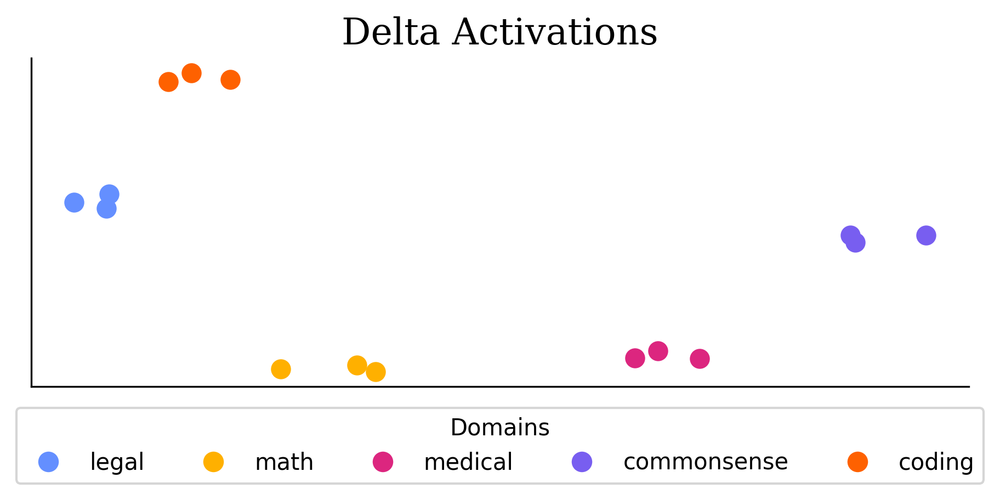

## 1  Environment setup

```bash
conda create -n delta python=3.11 -y
conda activate delta

# Core libraries
pip install -r requirements.txt

```

> **Hardware:** All scripts run on a single H100 (80 GB) 

---

## 2  Repository structure

| Path | Purpose |
|------|---------|
| `sft/finetune_math.py` | Supervised fine-tuning on **MATH** (GSM-8K) with LoRA / full-parameter switch |
| `sft/finetune_commonsense.py` | **COMMONSENSE** fine-tuning (HellaSwag) |
| `sft/finetune_legal.py` | **LEGAL** fine-tuning (LegalBench – privacy_policy_qa) |
| `sft/finetune_med.py` | **MEDICAL** fine-tuning (PubMedQA) |
| `sft/finetune_coding.py` | **CODING** fine-tuning (OPC-SFT educational_instruct) |
| `tulu/finetune_tulu.py` | Multi-domain chat fine-tuning on selected Tülu subsets |
| `rl/dpo.py` | Direct Preference Optimization (DPO) alignment script |
| `delta_activations.ipynb` | Notebook for analyzing and visualizing delta activations |

---

## 2.1  Delta Activations visualization



*Figure: Visualization of how delta activations cluster models trained from same domain. The process of computing and analyzing delta activations can be found in `delta_activations.ipynb`.*


## 3  Anonymous model checkpoints

All trained adapters are publicly available under the anonymous account **Anonymous19782130**:

| Domain | Split | HF repo ID |
|--------|-------|-----------|
| MATH | first / second / third | `Anonymous19782130/llama-3.1-8b-math-{first\|second\|third}` |
| LEGAL | first / second / third | `Anonymous19782130/llama-3.1-8b-legal-{first\|second\|third}` |
| MEDICAL | first / second / third | `Anonymous19782130/llama-3.1-8b-medical-{first\|second\|third}` |
| COMMONSENSE | first / second / third | `Anonymous19782130/llama-3.1-8b-commonsense-{first\|second\|third}` |
| CODING | first / second / third | `Anonymous19782130/llama-3.1-8b-coding-{first\|second\|third}` |

---

## 4  Reproducing a run

```bash
python finetune_math.py \
    --model_name meta-llama/Llama-3.1-8B \
    --split first \
    --batch_size 4 \
    --learning_rate 1e-4 \
    --num_epochs 3
```
---
